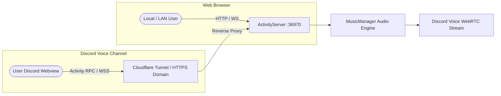

# 🤖 MeloVista Discord Music Bot & Embedded Activity UI (`@music/bot`)

Phân hệ **Discord Music Bot & Giao diện điều khiển thời gian thực (Embedded Activity UI)** chất lượng cao trong hệ sinh thái đa nền tảng **MeloVista**.

---

## ✨ Tính Năng Nổi Bật

- 🔒 **Discord DAVE Protocol E2EE**: Tích hợp chuẩn mã hóa đầu cuối mới nhất của Discord (`@discordjs/voice@0.19.2` + `@snazzah/davey@0.1.12`), vượt qua mã lỗi `4017`.
- ⚡ **Audio Pipeline Zero-Latency**: FFmpeg `s16le` 48kHz Stereo ➔ Opus 20ms Frame phát tức thì (< 1.5s).
- 🎵 **Nguồn Nhạc Đa Dạng**: Hỗ trợ phát nhạc từ YouTube (với cơ chế nạp cookies bypass 403 / Bot Detection) và stream trực tiếp nhạc Lossless cục bộ (`.flac`, `.mp3`, `.wav`) từ máy tính.
- 📱 **Discord Embedded Activity UI (Webview App)**: Giao diện web trực quan nhúng trực tiếp trong Discord Voice Channel hoặc trình duyệt web, đồng bộ trạng thái phát nhạc (Seek bar, Volume, Queue, Search, Lyrics) đa người dùng thời gian thực qua WebSocket RPC.
- 🎛️ **Rich Embeds & Button Controls**: Bảng điều khiển Discord Embed sang trọng kèm hàng nút bấm tương tác nhanh (Play/Pause, Skip, Stop, Queue).

---

## 🚀 Khởi Động Nhanh

### 1. Cài đặt Phụ Thuộc
Tại thư mục gốc của Monorepo:
```bash
npm install
```

### 2. Cấu Hình Biến Môi Trường
Tạo file `apps/bot/.env` (tham khảo `apps/bot/.env.example`):
```env
# 1. Token Bot từ Discord Developer Portal (Mục Bot -> Reset Token)
DISCORD_TOKEN=your_bot_token_here

# 2. Application Client ID (Mục General Information -> Application ID)
CLIENT_ID=your_client_id_here

# 3. Guild Server ID (Chuột phải vào icon Server Discord -> Copy Server ID để sync lệnh tức thì)
GUILD_ID=your_test_guild_id_here

# 4. Cổng HTTP/WebSocket Server cho Bot UI (Mặc định: 36970)
PORT=36970

# 5. Đường dẫn file Cookie YouTube (Tùy chọn - bypass lỗi 403 / giới hạn độ tuổi)
COOKIES_PATH=
```

### 3. Build Giao Diện Web Bot UI (Vite Bundle)
Để tạo gói giao diện tĩnh phục vụ cho Webview & Activity Server:
```bash
npm run build --workspace=apps/bot
```
*(Lệnh trên sẽ build React UI từ `apps/bot/src/web` vào thư mục `apps/bot/public`)*

### 4. Chạy Bot & Activity Server
- **Chế độ Lập trình (Hot Reload tự động)**:
  ```bash
  npm run bot:dev
  ```
- **Chế độ Sản phẩm (Production)**:
  ```bash
  npm run bot
  ```

---

## 🌐 Hướng Dẫn Triển Khai Bot UI (Bot UI Deployment Guide)

Phân hệ Bot UI của MeloVista bao gồm **Web Dashboard độc lập** và **Discord Embedded Activity** (giao diện nhúng trực tiếp trong phòng thoại Voice Channel).



### 🔹 Phương Án 1: Truy Cập Web Dashboard Trực Tiếp (Local & Mạng LAN)

Khi chạy Bot (`npm run bot` hoặc `npm run bot:dev`), `ActivityServer` sẽ tự động khởi chạy HTTP Server và WebSocket Server tại cổng `PORT` (mặc định là `36970`):

1. Mở trình duyệt web và truy cập:
   ```text
   http://localhost:36970
   ```
2. Nếu muốn truy cập từ thiết bị khác trong cùng mạng LAN:
   ```text
   http://<IP_MAY_CHU_CUA_BAN>:36970
   ```
3. **Tính năng**: Xem danh sách bài hát đang phát, thanh tiến trình thời gian thực, điều chỉnh âm lượng, tìm kiếm bài hát trên YouTube và thêm vào hàng đợi trực tiếp từ trình duyệt.

---

### 🔹 Phương Án 2: Triển Khai Discord Embedded Activity (Nhúng Vào Voice Channel)

Discord Embedded Activity cho phép người dùng trong phòng thoại mở trực tiếp giao diện nghe nhạc của MeloVista ngay bên trong ứng dụng Discord.

> [!IMPORTANT]
> **Yêu cầu kỹ thuật bắt buộc từ Discord**:
> Discord Webview **chỉ chấp nhận các kết nối bảo mật qua giao thức HTTPS và WebSocket WSS**. Do đó, bạn cần tạo một URL Public HTTPS trỏ về `http://localhost:36970`.

#### Bước 1: Tạo HTTPS Tunnel miễn phí (Khuyên dùng Cloudflare Tunnel)

**Cách A: Dùng Cloudflare Quick Tunnel (Nhanh nhất cho môi trường Dev / Cá nhân)**
```bash
# Cài đặt cloudflared (hoặc tải binary từ GitHub Cloudflare)
# Khởi chạy Quick Tunnel trỏ về cổng 36970:
cloudflared tunnel --url http://localhost:36970
```
Terminal sẽ in ra một đường dẫn HTTPS công khai (ví dụ: `https://melovista-demo.trycloudflare.com`).

**Cách B: Dùng Ngrok (Thay thế)**
```bash
ngrok http 36970
```
Lấy URL dạng `https://xxxx.ngrok-free.app`.

---

#### Bước 2: Cấu Hình Trên Discord Developer Portal

1. Truy cập vào trang [Discord Developer Portal](https://discord.com/developers/applications).
2. Chọn Ứng dụng Bot của bạn (Application).
3. Vào mục **Activities** ở menu bên trái.
4. Bật công tắc **Enable Activities** nếu chưa bật.
5. Cuộn xuống phần **URL Mappings** và nhấn **Add Mapping**:
   - **Prefix**: `/`
   - **Target**: Dán URL HTTPS từ Cloudflare Tunnel / Ngrok của bạn (Ví dụ: `melovista-demo.trycloudflare.com` hoặc domain cá nhân `music.yourdomain.com`).
6. Nhấn **Save Changes** để lưu cấu hình.

---

#### Bước 3: Khởi Chạy Activity Trong Discord

1. Mở ứng dụng Discord trên máy tính hoặc trình duyệt.
2. Tham gia vào một **Voice Channel** (Phòng thoại) bất kỳ trong Server của bạn.
3. Ở thanh điều khiển phòng thoại phía dưới, bấm vào nút **🚀 Bắt đầu Hoạt động (Start an Activity)**.
4. Chọn ứng dụng **MeloVista Music Player** từ danh sách.
5. Cửa sổ Activity sẽ mở ra ngay trong phòng thoại Discord, cho phép tất cả thành viên cùng xem danh sách phát, chỉnh nhạc và tương tác thời gian thực!

---

### 🔹 Phương Án 3: Triển Khai Sản Phẩm 24/7 Trên Cloud VPS

Để chạy Bot và Bot UI hoạt động liên tục 24/7 trên Cloud VPS (Ubuntu / Debian / Oracle Cloud):

1. **Chuẩn bị môi trường VPS**: Xem hướng dẫn chuẩn bị Node.js 20 LTS, FFmpeg, yt-dlp và Cloudflare Tunnel tại:  
   👉 [docs/bot/__BOT_vps_setup_guide.md](file:///k:/cross-platform-music-player-app/docs/bot/__BOT_vps_setup_guide.md)
2. **Quản lý tiến trình bằng PM2**:
   ```bash
   # Build UI bundle trước
   npm run build --workspace=apps/bot

   # Khởi chạy Bot qua PM2
   pm2 start "npm run bot" --name "melovista-bot"
   pm2 save
   pm2 startup
   ```

---

## 📜 Danh Sách Slash Commands & Nút Bấm

| Lệnh Slash | Tham Số | Mô Tả |
| :--- | :--- | :--- |
| `/play` | `query` (Bắt buộc) | Phát bài hát từ YouTube URL / Tên bài hát / File nhạc Local. |
| `/pause` | *Không* | Tạm dừng hoặc tiếp tục phát bài hát hiện tại. |
| `/skip` | *Không* | Chuyển sang bài hát tiếp theo trong hàng đợi. |
| `/stop` | *Không* | Dừng phát nhạc và dọn dẹp hàng đợi. |
| `/queue` | `page` (Tùy chọn) | Hiển thị danh sách các bài hát trong hàng đợi. |
| `/volume` | `percent` (1-100) | Điều chỉnh mức âm lượng của bot. |
| `/loop` | `mode` (`off`/`track`/`queue`) | Chuyển đổi chế độ lặp lại bài hát hoặc hàng đợi. |
| `/shuffle` | *Không* | Trộn ngẫu nhiên thứ tự các bài hát trong hàng đợi. |
| `/ping` | *Không* | Kiểm tra độ trễ Gateway và Roundtrip WebSocket. |
| `/join` | *Không* | Mời bot tham gia phòng thoại hiện tại. |
| `/leave` | *Không* | Ngắt kết nối và cho bot rời khỏi phòng thoại. |

---

## 🧪 Kiểm Thử (Testing)

Chạy bộ kiểm thử tự động toàn diện với Vitest:
```bash
npm run test --workspace=apps/bot
```

---

## 📚 Tài Liệu Kỹ Thuật Chi Tiết

- 📄 [Báo Cáo Kỹ Thuật Tổng Thể & Nghiệm Thu](file:///k:/cross-platform-music-player-app/docs/bot/__BOT_FINAL_REPORT.md)
- 🏗️ [Báo Cáo Kiến Trúc & Chi Tiết Module](file:///k:/cross-platform-music-player-app/docs/bot/__BOT_architecture_report.md)
- 🔊 [Quy Chuẩn Xử Lý Luồng Âm Thanh (Audio Pipeline)](file:///k:/cross-platform-music-player-app/docs/bot/__BOT_audio_pipeline.md)
- 🚀 [Hướng Dẫn Thiết Lập VPS Đám Mây 24/7](file:///k:/cross-platform-music-player-app/docs/bot/__BOT_vps_setup_guide.md)
- 🧪 [Kịch Bản Kiểm Thử Thủ Công (Manual Test Cases)](file:///k:/cross-platform-music-player-app/docs/bot/__BOT_manual_test_cases.md)
