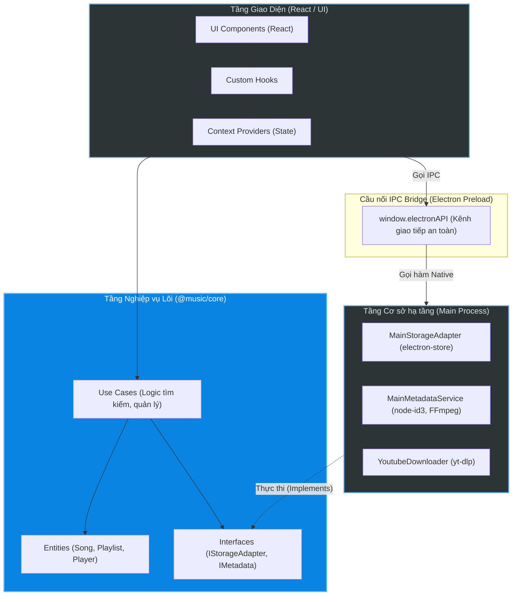

# Báo Cáo Dự Án

## 1. Tên đề tài
**Melovista** - Ứng dụng Phát nhạc Đa nền tảng (Cross-Platform Music Player App).

## 2. Các tính năng đã hoàn thiện (Làm được gì) & MVP của dự án
Dự án được xây dựng với mục tiêu cung cấp một trải nghiệm nghe nhạc chuyên nghiệp, tập trung phát triển và hoàn thiện phiên bản Desktop App làm Minimum Viable Product (MVP). Các thành tựu chính bao gồm:

### MVP của dự án
- **Audio Engine hiệu năng cao:** Tích hợp `howler.js` cùng Protocol tuỳ chỉnh `melovista://` để stream nhạc cục bộ an toàn. Cài đặt thuật toán Hashing âm thanh (Perceptual Hashing v2) để nhận diện bài hát độc nhất và quản lý hàng đợi, lịch sử phát nhạc.
- **Quản lý thư viện & Playlist:** Tự động quét file cục bộ, trích xuất siêu dữ liệu (Metadata, ID3 Tags) và hỗ trợ đầy đủ các thao tác CRUD cho Playlist.
- **Giao diện hiện đại (UI/UX):** Layout lấy cảm hứng từ Spotify, hệ thống màu Semantic (6 chủ đề), cơ chế lọc/tìm kiếm thông minh (Smart Intent), và hiển thị lời bài hát đồng bộ (Synced Lyrics).
- **Công cụ mở rộng mạnh mẽ:** Tích hợp `yt-dlp` và `FFmpeg` độc lập để tải nhạc trực tuyến, tự động dọn dẹp file rác, và hỗ trợ ghi đè/biên tập trực tiếp Metadata vào file vật lý.
- **Hệ thống kiểm thử (Testing):** Hoàn thiện cấu trúc Unit Test mạnh mẽ (Vitest & RTL), đạt 100% test coverage cho các logic nghiệp vụ lõi (`@music/core`, `utils`, `player`, `hooks`).

## 3. Kiến trúc hệ thống
Dự án được xây dựng trên nền tảng kiến trúc vững chắc, tuân thủ các nguyên lý thiết kế phần mềm hiện đại nhằm đảm bảo khả năng mở rộng (Scalability) và bảo trì (Maintainability):



- **Kiến trúc Clean Architecture & Monorepo:** 
  - Dự án được tổ chức theo mô hình Monorepo (sử dụng Yarn/Npm Workspaces) chia thành `apps/desktop`, `apps/mobile` và các package dùng chung như `@music/core`, `@music/types`. 
  - Lõi nghiệp vụ hoàn toàn độc lập với Framework giao diện. Tầng **Infrastructure** được chia tách rõ ràng (Backend sử dụng `electron-store`, `node-id3` trong khi Frontend sử dụng `Adapter` thông qua IPC Bridge) giúp code linh hoạt trên đa nền tảng.

  **Cấu trúc cây thư mục cốt lõi:**
  ```text
  melovista/
  ├── apps/
  │   ├── desktop/      # Ứng dụng Desktop (Electron + React + Vite)
  │   └── mobile/       # Ứng dụng Mobile (React Native / Expo)
  ├── packages/         # Các Module độc lập dùng chung cho cả 2 nền tảng
  │   ├── core/         # Lõi nghiệp vụ (LibraryService, Hashing, Playlist Logic...)
  │   ├── hooks/        # React Hooks quản lý trạng thái (usePlayer, useLibrary)
  │   ├── player/       # Audio Engine (Điều khiển phát nhạc qua howler.js)
  │   ├── types/        # Định nghĩa kiểu dữ liệu chuẩn (TypeScript Interfaces)
  │   ├── ui/           # Các UI Components dùng chung
  │   ├── utils/        # Các hàm tiện ích (Format Time, Normalize String...)
  │   └── brand/        # Tài nguyên nhận diện thương hiệu (Logo, Icons)
  ├── docs/             # Tài liệu kỹ thuật & Báo cáo dự án
  ├── scripts/          # Các kịch bản CI/CD (Build, Deploy, Release)
  └── test/             # Hệ thống kiểm thử tập trung
  ```
- **Bảo mật IPC Bridge (Electron):** Giao tiếp giữa React (Renderer) và Node.js (Main) bị cô lập hoàn toàn và phải đi qua `preload.ts`. Chỉ các hàm API an toàn (`window.electronAPI`) mới được cấp phép thực thi, bảo vệ người dùng khỏi lỗ hổng RCE.
- **Áp dụng các Design Pattern cốt lõi:**
  - **Strategy Pattern:** Quản lý quy trình Tải xuống (Downloader). Hệ thống linh hoạt hoán đổi chiến lược tải Playlist (`fetchPlaylistInfo`) hoặc tải bài đơn (`fetchYtInfo`) mà không cần thay đổi cấu trúc mã lõi (tuân thủ OCP).
  - **State Pattern:** Điều khiển các hệ thống phức tạp như `Audio Engine` (PLAYING, BUFFERING) và `Downloader State Machine` (FETCHING, DOWNLOADING). Trạng thái quản lý chặt chẽ cách hiển thị giao diện và các quyền tương tác của người dùng.
  - **Factory / Builder Pattern:** Ứng dụng trong `Theme Engine` (Hệ thống chủ đề). `ThemeProvider` đóng vai trò là "nhà máy" sản xuất tự động hàng chục biến CSS Semantic Color dựa trên thiết lập (Midnight, Rose, Nord...) để giải quyết triệt để vấn đề màu tĩnh (ghost variables).

## 4. Tiến độ dự án
Theo hệ thống quản lý (Roadmap), dự án đang tiến triển vượt bậc và đã hoàn thành phần lớn các mục tiêu cốt lõi để tạo thành một sản phẩm hoàn chỉnh:

- ✅ **Giai đoạn 1 (Hoàn thiện MVP):** Hoàn thành 100%. (Bản Release 1.0.1 đã sẵn sàng).
- ✅ **Giai đoạn 2 (Tối ưu & Tính năng phụ):** Hoàn thành 100%. (Đa ngôn ngữ, Hotkeys toàn cục).
- ✅ **Giai đoạn 3 (Làm đẹp & Trải nghiệm nâng cao):** Hoàn thành 90%. (Hoàn thiện 6 chủ đề nhưng giao diện chưa đẹp lắm, lưu trữ UI trạng thái).
- ✅ **Giai đoạn 4 (Chuyên sâu & Quản lý file):** Hoàn thành 100%. (Tải nhạc online, biên tập metadata).
- 🔄 **Giai đoạn 5 (Tính năng mở rộng - Trong kế hoạch tương lai):**
  - [ ] Bộ chỉnh âm nâng cao (Advanced Equalizer) & Visualizer.
  - [ ] Tính năng đồng bộ hóa (Sync) Cloud cho thư viện.
  - [ ] Trang hồ sơ nghệ sĩ chi tiết (Artist Profile).

**Đánh giá tổng quan:** Hiện tại, phiên bản Desktop của ứng dụng đã hoàn thiện, ổn định và sẵn sàng cho việc sử dụng thực tế. Dự án đạt độ an toàn cao về logic với Unit Testing chặt chẽ và cơ sở kiến trúc chuyên nghiệp.
