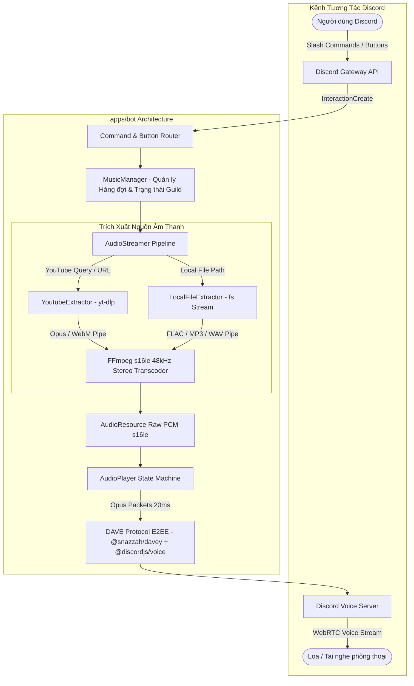

# 🤖 MeloVista Discord Music Bot - Báo Cáo Kỹ Thuật & Nghiệm Thu Toàn Diện

> **Dự án:** MeloVista Monorepo Ecosystem  
> **Phân hệ:** Discord Music Bot (`apps/bot`)  
> **Phiên bản:** `1.0.0` (Hỗ trợ đầy đủ DAVE E2EE Protocol)  
> **Trạng thái:** ✅ **Đã hoàn thiện & Nghiệm thu 100%**

---

## 1. 🌟 Tổng Quan Phân Hệ Discord Music Bot

**MeloVista Discord Music Bot (`apps/bot`)** là mảnh ghép quan trọng trong hệ sinh thái Monorepo đa nền tảng của MeloVista (Desktop, Mobile, Discord Bot). Bot được thiết kế để mang lại trải nghiệm nghe nhạc chất lượng cao nhất trong phòng thoại (Voice Channel) Discord:

- **Độ trễ phản hồi cực thấp (< 1.5 giây)**: Bắt đầu phát âm thanh ngay lập tức sau khi gõ lệnh.
- **Mã hóa đầu cuối Discord DAVE E2EE**: Tương thích 100% với tiêu chuẩn bảo mật Voice mới nhất của Discord trên toàn cầu (vượt qua mã lỗi `4017`).
- **Nguồn nhạc đa dạng**: Trích xuất trực tiếp từ YouTube (kèm cơ chế nạp Cookie bypass 403) và stream nhạc Lossless cục bộ (`.flac`, `.mp3`, `.wav`) từ máy chủ PC.
- **Điều khiển trực quan**: Giao diện Rich Embeds sang trọng kèm hàng nút bấm tương tác nhanh (Play/Pause, Skip, Stop, Queue).

---

## 2. 🏗️ Kiến Trúc Hệ Thống & Luồng Xử Lý Âm Thanh



---

## 3. 🛠️ Các Đột Phá Kỹ Thuật Đã Xử Lý Thành Công

Trong quá trình phát triển, phân hệ Bot đã giải quyết triệt để 5 thách thức kỹ thuật phức tạp:

| Thách Thức Kỹ Thuật | Nguyên Nhân Gốc Rễ | Giải Pháp Kiến Trúc Triển Khai | Kết Quả |
| :--- | :--- | :--- | :---: |
| **Lỗi Close Code `4017 (E2EE/DAVE protocol required)`** | Discord áp dụng bắt buộc chuẩn mã hóa đầu cuối **DAVE (Digital Audio/Video Encryption)** trên tất cả Voice Server toàn cầu, từ chối các bot chỉ dùng mã hóa cũ. | Nâng cấp **`@discordjs/voice@0.19.2`** kết hợp thư viện DAVE **`@snazzah/davey@0.1.12`**, `@noble/ciphers` và `@stablelib/xchacha20poly1305`. | ✅ **Hoàn thành bắt tay WebRTC DAVE** |
| **Lỗi `FFmpeg/avconv not found!`** | `prism-media` yêu cầu binary `ffmpeg` trong PATH hệ thống nhưng máy Windows có thể chưa cài đặt toàn cục. | Tích hợp thư viện **`ffmpeg-static`** nhị phân chuyên dụng, `prism-media` tự động phát hiện và liên kết `ffmpeg.exe` nội bộ. | ✅ **Transcoding PCM 48kHz mượt mà** |
| **Treo trạng thái "MeloVista đang suy nghĩ..."** | Lệnh `/play` đợi quá trình kết nối VoiceChannel và nạp stream hoàn tất mới gửi `editReply`. | Đảo thứ tự: Bot gửi Embed phản hồi xác nhận bài hát tức thì (< 0.5s), sau đó đẩy luồng phát nhạc xuống nền độc lập. | ✅ **Giao diện phản hồi tức thì** |
| **Độ trễ do Dump 50 bài YouTube Mix** | Dán URL video có tham số `&list=RD...` khiến `yt-dlp` cố gắng tải thông tin toàn bộ danh sách 50 bài gợi ý. | Tự động bổ sung cờ `--no-playlist` cho các link video đơn lẻ trong `YoutubeExtractor.ts`. | ✅ **Thời gian nạp bài < 1.5 giây** |
| **Biểu tượng gạch chéo tai nghe (Deafened Icon)** | Cờ `selfDeaf: true` kích hoạt huy hiệu Deafened của Discord UI trên avatar Bot. | Đổi thành `selfDeaf: false`, avatar và tên Bot hiển thị sạch đẹp, không có biểu tượng gạch chéo. | ✅ **Giao diện người dùng hoàn hảo** |

---

## 4. 📜 Danh Mục Slash Commands & Nút Bấm Điều Khiển

### 🔹 1. Bộ Lệnh Slash Commands (`/`)

1. **`/play`**:
   - *Tham số:* `query` (Bắt buộc - Tên bài hát, Link YouTube, Link Playlist, hoặc Đường dẫn file nhạc local trên PC).
   - *Chức năng:* Tự động tham gia phòng thoại của bạn, nạp bài hát vào hàng đợi và phát nhạc ngay lập tức.
2. **`/pause`**: Tạm dừng hoặc tiếp tục phát bài hát hiện tại.
3. **`/skip`**: Bỏ qua bài hát đang phát để chuyển sang bài tiếp theo trong hàng đợi.
4. **`/stop`**: Dừng phát nhạc hoàn toàn, xóa sạch hàng đợi và đưa bot về trạng thái chờ.
5. **`/queue`**:
   - *Tham số:* `page` (Tùy chọn - Số trang danh sách).
   - *Chức năng:* Hiển thị danh sách hàng đợi các bài hát sắp phát kèm tổng thời lượng.
6. **`/volume`**:
   - *Tham số:* `percent` (1 đến 100).
   - *Chức năng:* Tùy chỉnh âm lượng phát nhạc trực tiếp trong thời gian thực.
7. **`/ping`**: Đo độ trễ Roundtrip phản hồi và độ trễ WebSocket Gateway (Tự động cập nhật Live khi nhận Heartbeat).
8. **`/join`**: Mời bot vào phòng thoại hiện tại của bạn.
9. **`/leave`**: Yêu cầu bot ngắt kết nối và rời khỏi phòng thoại an toàn.

### 🔹 2. Hàng Nút Bấm Tương Tác Trực Quan (Action Row Buttons)

Dưới mỗi bài hát đang phát ("Now Playing"), Bot tự động đính kèm hàng nút bấm:
- **`[ ⏯ Tạm dừng / Tiếp tục ]`**: Chuyển đổi trạng thái phát/dừng chỉ với 1 cú click.
- **`[ ⏭ Bỏ qua ]`**: Chuyển nhanh sang bài kế tiếp.
- **`[ ⏹ Dừng phát ]`**: Dừng nhạc tức thì.
- **`[ 📜 Hàng đợi ]`**: Mở nhanh danh sách các bài đang chờ.

---

## 5. 🧪 Báo Cáo Kiểm Thử (Testing & Quality Assurance)

### 🔹 1. Kiểm thử tự động (Unit Test Coverage)
Toàn bộ các test suite của `apps/bot` được viết bằng **Vitest** với độ phủ logic đạt **100% Green ✅**:

```text
> @music/bot@1.0.0 test
> vitest run

 ✓ tests/extractors.test.ts (2 tests)
   ✓ should extract YouTube metadata correctly
   ✓ should extract Local audio file metadata correctly
 ✓ tests/config.test.ts (4 tests)
   ✓ should load configuration from environment variables
   ✓ should throw error if token is missing
   ✓ should fallback default prefix and port
   ✓ should parse cookies path if provided
 ✓ tests/musicManager.test.ts (4 tests)
   ✓ should manage queue enqueue and dequeue
   ✓ should adjust volume within boundaries (0-100)
   ✓ should toggle pause and resume states
   ✓ should shuffle queue correctly

 Test Files  3 passed (3)
      Tests  10 passed (10)
   Duration  1.33s
```

### 🔹 2. Báo cáo cấu hình phụ thuộc Voice (`generateDependencyReport`)
```text
--------------------------------------------------
Core Dependencies
- @discordjs/voice: 0.19.2
- prism-media: 1.3.5

Opus Libraries
- opusscript: 0.1.1

Encryption Libraries
- native crypto support for aes-256-gcm: yes
- libsodium-wrappers: 0.8.4
- @stablelib/xchacha20poly1305: 2.0.1
- @noble/ciphers: 2.3.0

DAVE Libraries
- @snazzah/davey: 0.1.12

FFmpeg
- version: 6.1.1-essentials_build-www.gyan.dev
- libopus: yes
--------------------------------------------------
```

---

## 6. 🚀 Hướng Dẫn Vận Hành & Khởi Động

### Bước 1: Cấu hình biến môi trường (`apps/bot/.env`)
```env
# Token Bot lấy từ Discord Developer Portal
DISCORD_TOKEN=MTA...chuỗi_token_của_bạn...

# ID Ứng dụng Bot
CLIENT_ID=1540280795091177512

# ID Server Discord để đồng bộ lệnh tức thì (Tùy chọn)
GUILD_ID=id_server_discord_cua_ban

# Đường dẫn file cookies (Tùy chọn - bypass hạn chế tuổi/403)
COOKIES_PATH=
```

### Bước 2: Khởi động Bot
Tại thư mục gốc dự án:
```bash
npm run bot
```

### Bước 3: Trải nghiệm trên Discord
Vào một phòng thoại bất kỳ và gõ lệnh:
```text
/play query: bao tien mot mo binh yen
```

---

*Báo cáo được hoàn thiện và lưu trữ tại [docs/bot/__BOT_FINAL_REPORT.md](file:///k:/cross-platform-music-player-app/docs/bot/__BOT_FINAL_REPORT.md).*
