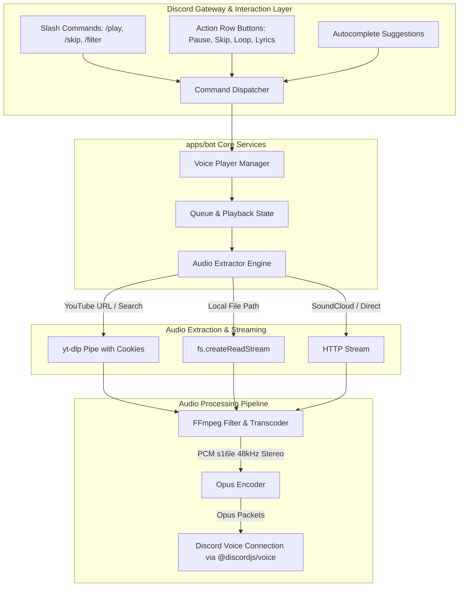

# MeloVista Discord Music Bot Architecture Report 🤖🎵

Tài liệu thiết kế kiến trúc kỹ thuật chi tiết cho ứng dụng **MeloVista Discord Music Bot (`apps/bot`)** trong hệ sinh thái Monorepo của dự án MeloVista.

---

## 1. Mục Tiêu & Định Vị Sản Phẩm

- **Mục tiêu:** Xây dựng Discord Music Bot phục vụ nhu cầu nghe nhạc cá nhân và nhóm bạn thân với chất lượng cao nhất, loại bỏ hoàn toàn các hạn chế thường gặp ở các bot công cộng.
- **Định vị trong Monorepo:** Là một workspace độc lập `apps/bot`, tái sử dụng toàn bộ logic nghiệp vụ, entities, types và utils từ các package dùng chung (`@music/core`, `@music/player`, `@music/types`, `@music/utils`).

---

## 2. Sơ Đồ Cấu Trúc Monorepo Tích Hợp

```
cross-platform-music-player-app/
├── apps/
│   ├── desktop/                 # Electron Desktop Application
│   ├── mobile/                  # React Native / Expo Mobile Application
│   └── bot/                     # [MỚI] Discord Music Bot Application
│       ├── src/
│       │   ├── commands/        # Slash Command Handlers (/play, /skip, /queue...)
│       │   ├── events/          # Gateway Event Listeners (ready, interactionCreate...)
│       │   ├── services/        # AudioPlayerService, VoiceConnectionService
│       │   ├── extractors/      # YtDlpStreamExtractor, LocalFileExtractor
│       │   ├── ui/              # Rich Embed Templates, Button/Menu Builders
│       │   ├── config/          # Environment Config & Constants
│       │   └── index.ts         # Bot Entry Point
│       ├── package.json
│       └── tsconfig.json
├── packages/
│   ├── core/                    # LibraryService, Track, Playlist, Mutex
│   ├── player/                  # Audio State & Queue Logic
│   ├── types/                   # Shared Interfaces & Enums
│   └── utils/                   # Time formatting, YouTube utils, Artist splitting
└── docs/
    ├── desktop/                 # Tài liệu Desktop App
    ├── mobile/                  # Tài liệu Mobile App
    └── bot/                     # [MỚI] Tài liệu Discord Bot
```

---

## 3. Các Thành Phần Kiến Trúc Chính (Core Subsystems)



---

## 4. Đặc Điểm Kỹ Thuật Nổi Bật

### 4.1. Bypass Triệt Để Lỗi YouTube 403 & Bot Detection
- Sử dụng trực tiếp file cookie trích xuất từ tài khoản YouTube cá nhân (`youtube_cookies.txt`).
- Thực thi thông qua `yt-dlp` binary độc lập, không phụ thuộc vào các API trung gian của bên thứ ba.

### 4.2. Trích Xuất & Phát Âm Thanh Zero-Latency (Stream Piping)
- Luồng âm thanh được pipe trực tiếp qua `stdout` của `yt-dlp` vào `stdin` của `FFmpeg` mà không cần ghi file tạm ra đĩa cứng.
- Thời gian bắt đầu phát nhạc (Time to First Audio Packet) < 1 giây.

### 4.3. Hỗ Trợ Kho Nhạc Cục Bộ (Local Lossless Streaming)
- Tận dụng khả năng truy cập hệ thống tệp cục bộ trên máy tính hoặc Home Server để stream các tệp `.flac`, `.wav`, `.mp3` chất lượng cao lên Discord Voice Channel.

### 4.4. Giao Diện Tương Tác Hiện Đại (Component-First UI)
- Phản hồi trạng thái phát nhạc qua Rich Embeds kèm dynamic timebar.
- Hàng phím điều khiển nhanh (Action Row Buttons): Pause, Play, Skip, Loop, Shuffle, Synchronized Lyrics.

---

## 5. Quy Trình Vận Hành & Triển Khai (Deployment)

1. **Chế độ phát triển & chạy tại máy cá nhân (Local Mode - 0đ):**
   - Khởi chạy bằng lệnh: `npm run start --workspace=apps/bot` hoặc `pm2 start apps/bot/dist/index.js`.
2. **Chế độ máy chủ 24/7 (Oracle Cloud Always Free / Docker - 0đ):**
   - Đóng gói bằng `Dockerfile` tối giản dựa trên `node:20-alpine` kèm binary `ffmpeg` và `yt-dlp`.
