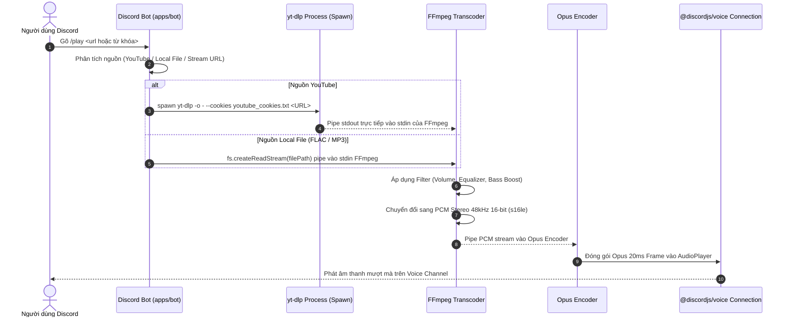

# MeloVista Discord Bot Audio Pipeline Specification 🔊

Tài liệu đặc tả kỹ thuật chi tiết về luồng xử lý âm thanh, trích xuất dữ liệu và mã hóa Opus trong **MeloVista Discord Bot (`apps/bot`)**.

---

## 1. Sơ Đồ Pipeline Âm Thanh Chi Tiết (Detailed Audio Stream Flow)



---

## 2. Thông Số Kỹ Thuật Định Dạng (Audio Format Specs)

| Thông số | Giá trị | Giải thích |
| :--- | :--- | :--- |
| **Sampling Rate (Tần số lấy mẫu)** | `48000 Hz (48kHz)` | Chuẩn âm thanh bắt buộc của Discord WebRTC Engine. |
| **Channels (Số kênh)** | `2 (Stereo)` | Âm thanh nổi 2 kênh. |
| **Bit Depth (Độ sâu bit)** | `16-bit signed integer (s16le)` | Định dạng PCM tiêu chuẩn trước khi đưa vào Opus. |
| **Frame Size (Độ dài khung)** | `20 ms (960 samples/kênh)` | Mỗi gói tin âm thanh Voice UDP tương ứng 20ms. |
| **Bitrate mục tiêu** | `64kbps - 384kbps` | Tự động nâng theo cấp độ Server Boost của Guild Discord. |

---

## 3. Cấu Hình Lệnh FFmpeg Chuẩn Hóa

### 3.1. Lệnh Transcode Tiêu Chuẩn (Zero-Filter):
```bash
ffmpeg -i pipe:0 \
  -analyzeduration 0 \
  -loglevel error \
  -f s16le \
  -ar 48000 \
  -ac 2 \
  pipe:1
```

### 3.2. Lệnh Tích Hợp DSP Filters (Equalizer / Bass Boost / Nightcore):
```bash
ffmpeg -i pipe:0 \
  -analyzeduration 0 \
  -loglevel error \
  -af "bass=g=5:f=110:w=0.6, asetrate=48000*1.15, aresample=48000" \
  -f s16le \
  -ar 48000 \
  -ac 2 \
  pipe:1
```

---

## 4. Xử Lý Lỗi & Phục Hồi Kết Nối (Error Handling & Resilience)

1. **Deadlock Prevention (Chống Treo Bộ Đệm):**
   - Quản lý kích thước `highWaterMark` của Stream để tránh đầy bộ đệm khi `yt-dlp` xuất dữ liệu nhanh hơn tốc độ tiêu thụ của Discord Voice.
2. **Auto-Reconnect (Tự Động Kết Nối Lại):**
   - Lắng nghe sự kiện `VoiceConnectionStatus.Disconnected` và thử kết nối lại tối đa 5 lần trước khi hủy phiên.
3. **Graceful Cleanup (Dọn Dẹp Tiến Trình):**
   - Khi nhận lệnh `/stop` hoặc bài hát kết thúc, gửi tín hiệu `SIGKILL` tới các tiến trình con `yt-dlp` và `ffmpeg` để tránh rò rỉ bộ nhớ (Memory Leak).
