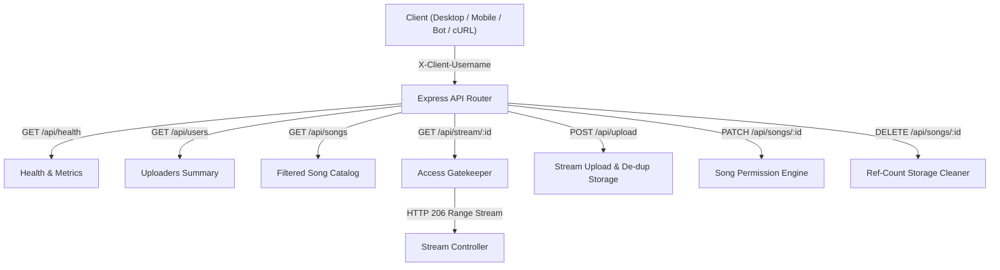

# 📡 MeloVista Streaming Server — Cẩm Nang Cú Pháp & Lệnh Tương Tác API

Tài liệu hướng dẫn chi tiết toàn bộ cú pháp, lệnh cURL, PowerShell và JavaScript/TypeScript để tương tác, quản trị và kiểm thử **MeloVista HTTP 206 Direct Streaming Server** (Node Homelab: `luxaztk-server` hoặc Local Dev).

---

## 🧭 1. Thông Tin Máy Chủ & Địa Chỉ Mặc Định

| Môi Trường | Host & Port | Địa Chỉ URL Mẫu | Ghi Chú |
| :--- | :--- | :--- | :--- |
| **Local Development** | `localhost:4545` | `http://127.0.0.1:4545` | Chạy dev trên máy cá nhân |
| **LAN Homelab Server** | `192.168.1.185:4545` | `http://192.168.1.185:4545` | Máy chủ Acer Aspire (Pentium N6000, Ubuntu 26.04) |
| **Cloudflare Tunnel / Domain** | Cổng 80/443 (HTTPS) | `https://stream.yourdomain.com` | Nếu cấu hình Reverse Proxy |

### Danh Sách Headers Định Danh & Phân Quyền (Gatekeeper Headers)

```http
X-Client-Username: <tên_người_dùng>     # Tên định danh client (VD: luxaztk, alex, guest)
X-Song-Visibility: <public|whitelist|private> # Chế độ chia sẻ khi upload
X-Song-Whitelist: <user1,user2,user3>   # Danh sách bạn bè được quyền nghe (dấu phẩy)
X-Song-Metadata: <json_string>          # JSON mã hóa URL chứa chapters, lyrics mở rộng
Range: bytes=<start>-<end>              # Tua nhạc / HTTP 206 Partial Content
Authorization: Bearer <token>           # Token bảo mật (nếu server bật xác thực)
```

---

## ⚡ 2. Cú Pháp Quản Trị & Vận Hành Dịch Vụ (PM2 / CLI)

### 2.1. Lệnh Khởi Chạy Local Dev & Production

```bash
# 1. Di chuyển vào thư mục gốc của dự án:
# Trên Linux Server (Homelab luxaztk-server):
cd ~/cross-platform-music-player-app
# Hoặc trên Windows (PowerShell/CMD):
cd K:\cross-platform-music-player-app

# 2. Khởi chạy server ở chế độ Development (Hot Reload bằng tsx)
npm run server:dev

# 3. Khởi chạy server Production (Workspace apps/server)
npm run server

# 4. Quét kiểm tra lỗi cú pháp TypeScript
npm run --workspace=apps/server tsc --noEmit
```

### 2.2. Quản Trị Dịch Vụ Nền Bằng PM2 (Production Ecosystem)

```bash
# Đảm bảo đang đứng tại thư mục gốc của dự án trước khi chạy PM2
cd ~/cross-platform-music-player-app

# Khởi động streaming server qua PM2
pm2 start ecosystem.config.cjs --only melovista-stream-server

# Xem bảng trạng thái thời gian thực (RAM, CPU, Uptime)
pm2 status

# Xem log trực tiếp của server
pm2 logs melovista-stream-server

# Khởi động lại service khi cập nhật mã nguồn
pm2 restart melovista-stream-server

# Dừng service
pm2 stop melovista-stream-server
```

### 2.3. Deploy Lên Homelab Server Qua SSH

```bash
# Di chuyển vào thư mục dự án và chạy script deploy tự động
cd ~/cross-platform-music-player-app
bash scripts/deploy-homelab.sh
```

---

## 🛠️ 3. Chi Tiết Cú Pháp Các Endpoint API



---

### 3.1. Kiểm Tra Sức Khỏe & Thống Kê Máy Chủ (`GET /api/health`)

Trả về trạng thái hoạt động, thời gian chạy (`uptime`), tổng số bài hát đã lập chỉ mục và dung lượng RAM tiêu thụ.

#### 📌 Cú pháp cURL:
```bash
curl -X GET "http://192.168.1.185:4545/api/health"
```

#### 📌 Cú pháp PowerShell:
```powershell
Invoke-RestMethod -Uri "http://192.168.1.185:4545/api/health" -Method Get
```

#### 📌 Phản hồi mẫu (JSON `200 OK`):
```json
{
  "status": "ok",
  "service": "melovista-streaming-server",
  "version": "1.0.0",
  "uptime": 86400,
  "totalSongs": 142,
  "memoryUsage": {
    "heapUsedMb": 42.15,
    "rssMb": 88.5
  },
  "timestamp": 1725700000000
}
```

---

### 3.2. Lấy Danh Sách Uploader Đang Hoạt Động (`GET /api/users`)

Liệt kê tất cả các uploader có bài hát trên máy chủ kèm theo số lượng bài đã tải lên và số bài công khai.

#### 📌 Cú pháp cURL:
```bash
curl -X GET "http://192.168.1.185:4545/api/users"
```

#### 📌 Cú pháp PowerShell:
```powershell
Invoke-RestMethod -Uri "http://192.168.1.185:4545/api/users" -Method Get
```

#### 📌 Phản hồi mẫu (JSON `200 OK`):
```json
{
  "users": [
    { "username": "luxaztk", "songCount": 120, "publicCount": 85 },
    { "username": "alex", "songCount": 15, "publicCount": 15 },
    { "username": "gamer99", "songCount": 7, "publicCount": 0 }
  ]
}
```

---

### 3.3. Lấy Danh Mục Bài Hát Có Quyền Truy Cập (`GET /api/songs`)

Lấy toàn bộ bài hát mà người dùng được cấp quyền nghe. Hỗ trợ lọc theo từng uploader cụ thể qua query `?uploader=`.

#### 📌 Cú pháp cURL:
```bash
# 1. Lấy tất cả bài công khai (Khách vãng lai)
curl -X GET "http://192.168.1.185:4545/api/songs"

# 2. Lấy bài hát kèm theo định danh người dùng (Mở khóa bài Whitelist & Private của bạn)
curl -X GET "http://192.168.1.185:4545/api/songs" \
  -H "X-Client-Username: luxaztk"

# 3. Lọc danh sách bài hát chỉ do 'alex' hoặc 'luxaztk' upload
curl -X GET "http://192.168.1.185:4545/api/songs?uploader=alex,luxaztk" \
  -H "X-Client-Username: luxaztk"
```

#### 📌 Cú pháp PowerShell:
```powershell
$headers = @{ "X-Client-Username" = "luxaztk" }
Invoke-RestMethod -Uri "http://192.168.1.185:4545/api/songs?uploader=alex" -Headers $headers -Method Get
```

---

### 3.4. Lấy Chi Tiết Metadata Một Bài Hát (`GET /api/songs/:id`)

#### 📌 Cú pháp cURL:
```bash
curl -X GET "http://192.168.1.185:4545/api/songs/song-uuid-123" \
  -H "X-Client-Username: luxaztk"
```

> [!WARNING]
> Nếu bài hát có chế độ `private` hoặc `whitelist` mà `X-Client-Username` không thuộc danh sách được cấp quyền, server sẽ trả về mã lỗi `403 Forbidden`:
> ```json
> { "error": "Access denied: You do not have permission to view this song" }
> ```

---

### 3.5. Phát Trực Tiếp Âm Thanh — Tua Nhạc (`GET /api/stream/:id`)

Hỗ trợ giao thức phát nhạc chuẩn **HTTP 206 Partial Content**, cho phép phát nhạc tức thì với độ trễ thấp và tua (Seek) đến bất kỳ vị trí nào mà không cần tải toàn bộ bài hát.

#### 📌 Cú pháp cURL (Phát từ đầu):
```bash
curl -i -X GET "http://192.168.1.185:4545/api/stream/song-uuid-123" \
  -H "X-Client-Username: luxaztk"
```

#### 📌 Cú pháp cURL (Tua nhạc bằng Range Header):
```bash
# Yêu cầu tải 1MB dữ liệu từ byte 1,048,576
curl -i -X GET "http://192.168.1.185:4545/api/stream/song-uuid-123" \
  -H "X-Client-Username: luxaztk" \
  -H "Range: bytes=1048576-2097151"
```

#### 📌 Phản hồi Header mẫu từ Server (`206 Partial Content`):
```http
HTTP/1.1 206 Partial Content
Content-Type: audio/mpeg
Accept-Ranges: bytes
Content-Range: bytes 1048576-2097151/35689240
Content-Length: 1048576
```

---

### 3.6. Tải Ảnh Bìa Bài Hát (`GET /api/cover/:id`)

#### 📌 Cú pháp cURL:
```bash
# Tải ảnh bìa và lưu thành file cover.jpg
curl -X GET "http://192.168.1.185:4545/api/cover/song-uuid-123" -o cover.jpg
```

---

### 3.7. Tải Bài Hát Lên Máy Chủ Kèm Phân Quyền (`POST /api/upload`)

Truyền luồng nhị phân (Binary Stream) của file âm thanh trực tiếp lên server. Server sẽ tự động tính toán mã hash âm thanh, phân loại theo thư mục `data/music/<Artist>/<Album>/<Filename>` và lưu metadata vào DB.

#### 📌 Cú pháp cURL tải bài hát Công khai (Public):
```bash
curl -X POST "http://192.168.1.185:4545/api/upload" \
  -H "Content-Type: application/octet-stream" \
  -H "X-File-Name: Starboy.mp3" \
  -H "X-Song-Title: Starboy" \
  -H "X-Song-Artist: The Weeknd" \
  -H "X-Song-Album: Starboy" \
  -H "X-Song-Duration: 230" \
  -H "X-Client-Username: luxaztk" \
  -H "X-Song-Visibility: public" \
  --data-binary @"/path/to/local/Starboy.mp3"
```

#### 📌 Cú pháp cURL tải bài hát Chỉ định Bạn bè (Whitelist):
```bash
curl -X POST "http://192.168.1.185:4545/api/upload" \
  -H "Content-Type: application/octet-stream" \
  -H "X-File-Name: SecretDemo.mp3" \
  -H "X-Song-Title: Secret Demo" \
  -H "X-Song-Artist: Producer X" \
  -H "X-Client-Username: luxaztk" \
  -H "X-Song-Visibility: whitelist" \
  -H "X-Song-Whitelist: alex,bob,charlie" \
  --data-binary @"/path/to/local/SecretDemo.mp3"
```

#### 📌 Cú pháp PowerShell tải bài hát:
```powershell
$filePath = "C:\Music\Song.mp3"
$headers = @{
    "X-File-Name"        = [System.IO.Path]::GetFileName($filePath)
    "X-Song-Title"       = "Song Title"
    "X-Song-Artist"      = "Artist Name"
    "X-Client-Username"  = "luxaztk"
    "X-Song-Visibility"  = "public"
    "Content-Type"       = "application/octet-stream"
}

Invoke-RestMethod -Uri "http://192.168.1.185:4545/api/upload" `
                  -Headers $headers `
                  -Method Post `
                  -InFile $filePath
```

---

### 3.8. Cập Nhật Quyền Riêng Tư & Whitelist Của Bài Hát (`PATCH /api/songs/:id`)

Cho phép Uploader chuyển đổi quyền bài hát (`public`, `whitelist`, `private`) và sửa danh sách bạn bè được cấp phép.

> [!IMPORTANT]
> Chỉ chính tài khoản uploader (`X-Client-Username`) đã tải bài hát lên mới có quyền sửa. Người khác sửa sẽ bị chặn mã lỗi `403 Forbidden`.

#### 📌 Cú pháp cURL chuyển sang Whitelist:
```bash
curl -X PATCH "http://192.168.1.185:4545/api/songs/song-uuid-123" \
  -H "Content-Type: application/json" \
  -H "X-Client-Username: luxaztk" \
  -d '{
    "visibility": "whitelist",
    "whitelist": ["alex", "bob", "charlie"]
  }'
```

#### 📌 Cú pháp cURL chuyển sang Riêng tư (Chỉ mình tôi):
```bash
curl -X PATCH "http://192.168.1.185:4545/api/songs/song-uuid-123" \
  -H "Content-Type: application/json" \
  -H "X-Client-Username: luxaztk" \
  -d '{
    "visibility": "private",
    "whitelist": []
  }'
```

#### 📌 Cú pháp PowerShell:
```powershell
$body = @{
    visibility = "whitelist"
    whitelist  = @("alex", "bob")
} | ConvertTo-Json

$headers = @{
    "Content-Type"      = "application/json"
    "X-Client-Username" = "luxaztk"
}

Invoke-RestMethod -Uri "http://192.168.1.185:4545/api/songs/song-uuid-123" `
                  -Headers $headers `
                  -Method Patch `
                  -Body $body
```

---

### 3.9. Xóa Bài Hát Khỏi Máy Chủ (`DELETE /api/songs/:id`)

Chỉ Uploader của bài hát mới có quyền xóa. Cơ chế **Reference Counting** đảm bảo: nếu có uploader khác cùng chia sẻ file âm thanh này (trùng hash), file vật lý vẫn được giữ nguyên; file vật lý trên đĩa cứng chỉ bị xóa khi không còn uploader nào sở hữu (`refCount === 0`).

#### 📌 Cú pháp cURL:
```bash
curl -X DELETE "http://192.168.1.185:4545/api/songs/song-uuid-123" \
  -H "X-Client-Username: luxaztk"
```

#### 📌 Phản hồi mẫu (`200 OK`):
```json
{
  "success": true,
  "id": "song-uuid-123"
}
```

---

### 3.10. Kiểm Tra Sai Khác & Chống Trùng Lặp (`POST /api/library/diff`)

Client gửi danh sách các bài hát chuẩn bị tải lên. Server sẽ so khớp vân tay âm thanh (`hash`) và metadata để trả về danh sách các bài đã có trên server (không cần tải lại) và các bài thực sự cần upload.

#### 📌 Cú pháp cURL:
```bash
curl -X POST "http://192.168.1.185:4545/api/library/diff" \
  -H "Content-Type: application/json" \
  -d '{
    "songs": [
      {
        "localId": "local-1",
        "title": "Starboy",
        "artist": "The Weeknd",
        "duration": 230,
        "hash": "e3b0c44298fc1c149afbf4c8996fb92427ae41e4649b934ca495991b7852b855"
      },
      {
        "localId": "local-2",
        "title": "New Track",
        "artist": "New Artist",
        "duration": 180,
        "hash": "another-hash"
      }
    ]
  }'
```

#### 📌 Phản hồi mẫu:
```json
{
  "toUploadIds": ["local-2"],
  "alreadyExists": [
    {
      "localId": "local-1",
      "serverId": "server-uuid-starboy",
      "matchReason": "HASH"
    }
  ]
}
```

---

### 3.11. Quét Lại Thư Mục Nhạc Cục Bộ (`POST /api/scan`)

Yêu cầu máy chủ quét lại toàn bộ cây thư mục `MUSIC_DIR` trên ổ đĩa để phát hiện các bài hát được chép trực tiếp vào server qua Samba, FTP hoặc rsync.

#### 📌 Cú pháp cURL:
```bash
curl -X POST "http://192.168.1.185:4545/api/scan" \
  -H "Content-Type: application/json" \
  -d '{ "directory": "./data/music" }'
```

---

## 💻 4. Code Mẫu Tương Tác Bằng TypeScript / JavaScript

Đoạn code mẫu sử dụng `ServerClient` từ gói `@music/core`:

```typescript
import { ServerClient } from '@music/core';

const SERVER_URL = 'http://192.168.1.185:4545';
const AUTH = { username: 'luxaztk' };

async function main() {
  // 1. Kiểm tra sức khỏe server
  const health = await ServerClient.checkHealth(SERVER_URL);
  console.log('Server Health:', health.health);

  // 2. Lấy danh sách uploader
  const usersRes = await ServerClient.fetchUsers(SERVER_URL, AUTH);
  console.log('Active Uploaders:', usersRes.users);

  // 3. Lấy kho nhạc của bạn bè
  const songsRes = await ServerClient.fetchSongs(SERVER_URL, AUTH, {
    uploaders: ['alex'],
  });
  console.log(`Tìm thấy ${songsRes.songs.length} bài hát của alex`);

  // 4. Đổi quyền bài hát sang Whitelist
  if (songsRes.songs.length > 0) {
    const targetSong = songsRes.songs[0];
    const updateRes = await ServerClient.updateSongPermissions(
      SERVER_URL,
      targetSong.id,
      {
        visibility: 'whitelist',
        whitelist: ['bob', 'charlie'],
      },
      AUTH
    );
    console.log('Cập nhật quyền thành công:', updateRes.song?.visibility);
  }
}

main().catch(console.error);
```

---

## 🚦 5. Bảng Mã Lỗi HTTP (HTTP Status Reference)

| HTTP Code | Ý Nghĩa | Tình Huống Gặp Phải |
| :--- | :--- | :--- |
| **`200 OK`** | Thành công | Trả về JSON dữ liệu hoặc xác nhận cập nhật |
| **`206 Partial Content`** | Phân đoạn âm thanh | Tua nhạc thành công theo Range header |
| **`400 Bad Request`** | Sai tham số yêu cầu | Thiếu file, thiếu header hoặc body JSON không hợp lệ |
| **`403 Forbidden`** | Bị từ chối truy cập | Người dùng không thuộc Whitelist, bài bị Private, hoặc không phải chủ bài hát khi cố gắng xóa/sửa |
| **`404 Not Found`** | Không tìm thấy | ID bài hát không tồn tại trên máy chủ |
| **`500 Internal Server Error`** | Lỗi máy chủ nội bộ | Lỗi ghi đĩa cứng, quyền file hệ điều hành, hoặc lỗi đọc ID3 tag |
