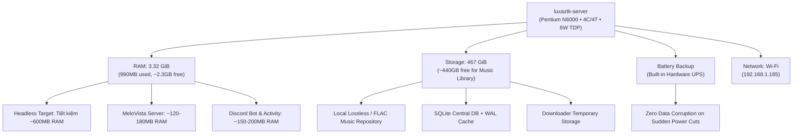

# MeloVista Homelab Server Specifications & Streaming Architecture Blueprint 🚀

Tài liệu đặc tả phần cứng, hồ sơ tài nguyên hệ thống và định hướng kiến trúc phát triển hạ tầng **MeloVista Server & Streaming Engine** (tối ưu hóa cho node máy chủ cá nhân `luxaztk-server`).

---

## 🖥️ 1. Bảng Thông Số Kỹ Thuật Máy Chủ (`luxaztk-server`)

Dữ liệu trích xuất từ hệ thống `fastfetch` ngày 04/09/2026:

| Thành Phần | Thông Số Chi Tiết | Đánh Giá & Ý Nghĩa Đối Với MeloVista |
| :--- | :--- | :--- |
| **Hostname / Node** | `luxaztk-server` | Node máy chủ nội bộ (Homelab / Edge Streaming Server) |
| **Model Phần Cứng** | Acer Aspire A314-35 (V1.14) | Laptop mỏng nhẹ tái sử dụng làm Home Server tiết kiệm điện |
| **Hệ Điều Hành (OS)** | Ubuntu 26.04.1 LTS (Resolute Raccoon) x86_64 | HĐH Linux Server ổn định, hỗ trợ lâu dài, kernel hiện đại |
| **Linux Kernel** | `Linux 7.0.0-30-generic` | Quản lý IO, thread scheduling và socket polling hiệu năng cao |
| **Vi Xử Lý (CPU)** | Intel® Pentium® Silver N6000 (4 cores, 4 threads @ 3.30 GHz) | Kiến trúc Jasper Lake 10nm, TDP 6W siêu tiết kiệm điện, hỗ trợ AVX / Intel QSV |
| **Đồ Họa (GPU)** | Intel® UHD Graphics (32 EUs @ 0.85 GHz) | Hỗ trợ VA-API / Intel Quick Sync Video (nếu cần giải mã media phần cứng) |
| **Bộ Nhớ Trong (RAM)**| **3.32 GiB usable** (Đang dùng: 990.65 MiB ~ 29%, Trống: ~2.33 GiB) | Đủ tải cho Node.js / Docker services nếu tối ưu hóa memory |
| **Bộ Nhớ Ảo (Swap)** | **3.63 GiB** (Đang dùng: 0 B ~ 0%) | Lưới an toàn chống Out-Of-Memory (OOM) |
| **Ổ Cứng Lưu Trữ (Disk)**| **467.35 GiB ext4** (Đang dùng: 7.77 GiB ~ 2%, **Còn trống: ~440+ GiB**) | Kho lưu trữ nhạc Lossless/FLAC/MP3 và cache cục bộ khổng lồ (~10.000 - 15.000 bài hát) |
| **Giao Tiếp Mạng (Network)**| Local IP: `192.168.1.185/24` (Interface: `wlp0s20f3` - Wi-Fi) | Kết nối mạng LAN nội bộ, có thể mở rộng qua Cloudflare Tunnel / Tailscale |
| **Nguồn & Pin (Power/UPS)**| Pin `AP19B8K` (100% - AC Connected) | **Tích hợp sẵn bộ lưu điện UPS phần cứng**, chống sập nguồn đột ngột khi mất điện |
| **Môi Trường Shell/Gói** | Bash 5.3.9, 757 packages (dpkg), 3 (snap) | Hệ thống sạch, ít dịch vụ nền rác |

---

## ⚡ 2. Phân Tích Năng Lực Phần Cứng & Giới Hạn Tài Nguyên



### 1. Điểm Mạnh Nổi Bật (Advantages)
1. **Siêu tiết kiệm điện (TDP 6W):** Chạy liên tục 24/7/365 với chi phí điện năng chỉ khoảng 10.000 - 20.000 VNĐ / tháng.
2. **UPS phần cứng tích hợp sẵn (Laptop Battery):** Khi mất điện, máy chủ vẫn duy trì hoạt động thêm 4 - 8 tiếng, đảm bảo database SQLite không bao giờ bị dở dang ghi tệp (Corrupted DB).
3. **Dung lượng lưu trữ dồi dào (~440+ GB trống):** Đủ chứa hàng chục nghìn bài hát chất lượng cao FLAC / Hi-Res Audio hoặc hàng trăm nghìn bài MP3 320kbps.
4. **4 Nhân x86_64 thực thụ:** Đủ sức stream audio trực tiếp cho hàng chục thiết bị đồng thời mà CPU chỉ dao động dưới 2 - 5%.

### 2. Thách Thức & Rào Cản Kỹ Thuật (Constraints)
1. **RAM giới hạn (3.32 GiB):** Hiện tại môi trường Desktop GUI đang chiếm ~990 MiB. Khi chạy nhiều container nặng có thể gây áp lực lên RAM.
   - *Giải pháp:* Tắt Display Manager nếu không dùng màn hình (`sudo systemctl set-default multi-user.target`) để thu hồi ~500-600MB RAM, đưa RAM nhàn rỗi về mức ~250-350MB.
2. **Kết nối mạng không dây (Wi-Fi `wlp0s20f3`):** Wi-Fi có thể bị jitter hoặc chập chờn khi có nhiều thiết bị phát cùng lúc.
   - *Khuyến nghị:* Cắm dây mạng LAN RJ45 trực tiếp vào Router/Modem (nếu có cổng qua USB-LAN Hub) để độ trễ (latency) đạt mức tối thiểu (< 1ms).

---

## 🎧 3. Định Hướng Kiến Trúc Streaming Cho MeloVista

Trên nền tảng máy chủ `luxaztk-server`, dự án MeloVista có thể mở rộng theo **3 Mô Hình Streaming Cốt Lõi**:

### Mô Hình A: Self-Hosted Audio Streaming Server (MeloVista Server Hub)
Máy chủ đóng vai trò là "Private Spotify Server" lưu trữ toàn bộ thư viện nhạc và truyền phát tới Client (Desktop, Mobile, Web):
- **Direct Stream (HTTP 206 Partial Content):** Hỗ trợ `Range: bytes=start-end` cho phép Client tua nhanh bài hát tức thì mà không cần nạp toàn bộ file, CPU máy chủ tải gần như **0%**.
- **On-the-Fly Audio Transcoding (FFmpeg Stream):** Tự động nén FLAC thành Opus/AAC khi thiết bị di động (Mobile) dùng mạng 4G/5G để tiết kiệm băng thông.
- **Subsonic / OpenSubsonic Protocol Compatibility (Tùy chọn):** Hỗ trợ API chuẩn của Subsonic để MeloVista Desktop/Mobile vừa kết nối được với Server nhà, vừa kết nối được với các thư viện nhạc mã nguồn mở khác (Navidrome, Jellyfin).

### Mô Hình B: Discord Bot & Embedded Activity Hosting 24/7
- Chuyển toàn bộ `apps/bot` (bao gồm Voice Streamer, FFmpeg Opus Pipeline, WebSocket RPC và Activity Server) lên chạy 24/7 trên `luxaztk-server`.
- Kết hợp **Cloudflare Tunnel (`cloudflared`)** để public cổng Activity Webview an toàn ra Internet với domain HTTPS hoàn toàn miễn phí mà không cần mở Port Forwarding trên Router.

### Mô Hình C: Centralized Cloudless Sync & Multi-Room Audio (Party Mode)
- Thay thế hoặc bổ trợ cho giải pháp Google Drive: Đồng bộ Playlists, Lịch sử nghe, Trạng thái đang phát (Playback State) giữa Máy tính làm việc và Điện thoại qua WebSocket máy chủ nội bộ.
- **Listen Together / Multi-Device Sync:** Chơi cùng một bài hát trên nhiều phòng/thiết bị cùng lúc với đồng bộ thời gian thực theo chuẩn NTP/PTP local.

---

## 🛠️ 4. Khuyến Nghị Tech-Stack Cho MeloVista Server

Để đảm bảo hiệu năng cao nhất trên phần cứng 4GB RAM / CPU 6W:

```
[ MeloVista Server Architecture Stack ]
├── Core Engine: Node.js (Fastify / TypeScript) - Xử lý IO bất đồng bộ, RAM cực nhẹ (~60-100MB)
├── Database: SQLite (WAL mode - Write-Ahead Logging) + Drizzle ORM - Tốc độ đọc 50.000 req/s, 0 daemon overhead
├── Streaming Pipeline: Native Node.js Stream / FFmpeg Pipe (Opus 48kHz / MP3 320k)
├── Remote Tunnel: Cloudflare Tunnel (cloudflared daemon ~15MB RAM) / Tailscale VPN Mesh
└── Process Management: PM2 (Single Node) hoặc Docker Compose (Cấu hình Resource Limits: max 512MB RAM)
```

---

## 📋 5. Kế Hoạch Triển Khai Tiếp Theo (Next Steps)

1. [ ] **Tối ưu hóa OS Máy Chủ:** Chuyển sang chế độ Headless (`multi-user.target`) và cấu hình Swappiness hợp lý (`vm.swappiness=10`).
2. [ ] **Khởi tạo Module `packages/server` hoặc `apps/server`:** Xây dựng Streaming API cốt lõi (HTTP Range Requests, Metadata Endpoint, Artwork Serve).
3. [ ] **Triển khai `apps/bot` lên `luxaztk-server`:** Thiết lập PM2 / Docker Compose kèm Cloudflare Tunnel.
4. [ ] **Tích hợp Client Adapter vào Desktop & Mobile:** Cho phép người dùng chuyển đổi linh hoạt giữa: *Thư viện Cục Bộ (Local)*, *Google Drive Cloud*, và *MeloVista Server Cá Nhân (`http://192.168.1.185:PORT`)*.
